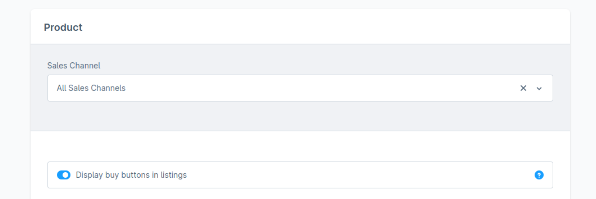

# Learning Objectives

By the end of this unit, you will be able to:
- Know the most common system configurations
- Understand how to configure system configurations via API

# Introduction
System configurations in Shopware 6 define how the system behaves and how it interacts with the user. They are used to configure various aspects of the system, such as the appearance of the storefront, the behavior of the administration, and the performance of the system.

Lets take a look at the setting `core.listing.allowBuyInListing` which is a system configuration that allows you to enable or disable the "Buy" button in the product listing.


## Admin settings

You can find the setting in the administration interface under `Settings > System > System configurations` ([link](admin#/sw/settings/listing/index))

It is a simple toggle and can be `true` or `false`. Per default it is set to `true`.



## Admin API

You can also configure system settings via the Admin API. Here is an example of how you can update the `core.listing.allowBuyInListing` setting via the Admin API:

Stoplight Link: [Update system configuration](https://shopware.stoplight.io/docs/admin-api/d4f8fb961b4c1-partially-update-information-about-a-system-config-resource)

```http
PATCH /api/system-config/c3b4f1b3c8e54f0e8e4e5e4e4e4e4e4e
Content-Type: application/json

{
  "id": "c3b4f1b3c8e54f0e8e4e5e4e4e4e4e4e",
  "configurationKey": "core.listing.allowBuyInListing",
  "configurationValue": "false"
}
```

## Static system configuration via .env or config yaml


:::info
This feature is available since Shopware 6.6.4.0 
:::

You can also set the `core.listing.allowBuyInListing` setting via the `.env` file or the `config/packages/shopware.yaml` file.

This is especially useful if you want to set the value for some or all of your environments. And if you want to have it versioned and not changeable via the administration interface.


```yaml
shopware:
  system_config:
    default:
      core.listing.allowBuyInListing: true
    # Disable it for the specific sales channel
    0188da12724970b9b4a708298259b171:
      core.listing.allowBuyInListing: false
 ```

For all possible options and more information, check out the [official documentation](https://developer.shopware.com/docs/guides/hosting/configurations/shopware/static-system-config.html#static-system-configuration)

## Quiz

1. What is the purpose of system configurations in Shopware?
   [x] To define how the system behaves and interacts with the user
   [x] To configure the appearance of the storefront
   [x] To configure the behavior of the administration
   [x] To configure the performance of the system
2. How can you configure system configurations via the API?
   [x] Via the Admin API
   [ ] Via the Store API
3. How can you set system configurations statically?
   [ ] Via the administration interface
   [x] Via the `.env` file
   [x] Via the `config/packages/shopware.yaml` file
